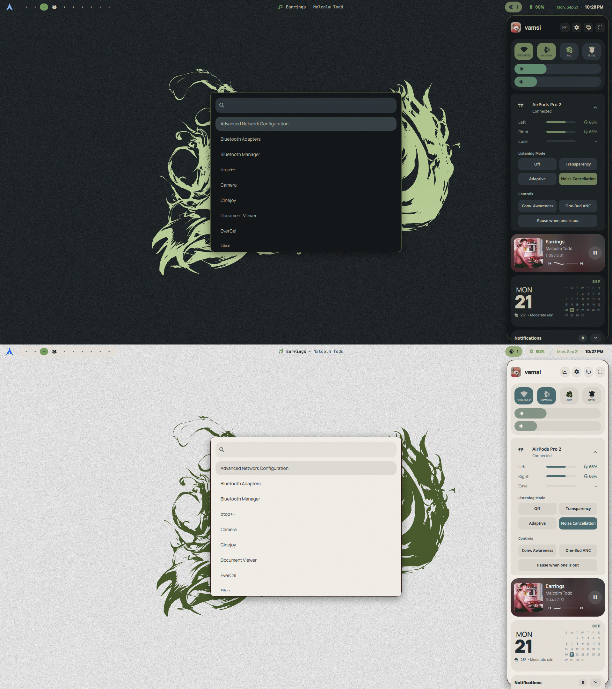

# surface-dots

My personal linux dotfiles.
Also, please check out my calendar app: [Evercal](https://github.com/snes19xx/EverCal)

---

## Table of contents

- [Screenshots](#screenshots)
- [Dependencies](#dependencies)
- [Installation](#Installation)
- [Hyprland](#hyprland)
- [Shaders](#shaders)
- [Desktop Layouts](#desktop-layouts)
- [Workflow guide](#workflow-guide)
- [Quickshell Hub](#quickshell-hub)
- [Power menu](#power-menu)
- [Firefox Customizations](#firefox-customizations)
- [Cursors](#cursors)
- [Lockscreens](#lockscreens)
- [GTK/QT Themes](#themes)
- [Utilities](#utilities)

---

## Screenshots

<div align="center">
<div style="display:flex; justify-content:center; gap:10px;">
  
  
  
</div>
<p><i>Desktop Layouts</i></p>

<br/>

<div style="display:flex; justify-content:center; gap:10px;">
  
  
  
</div>
<p><i>Cassini Powermenu, Reading Mode, Other system components</i></p>

</div>

## Dependencies

Everything below is on Arch. The installer does not install any of this for you, do it first.

**Official repos:**

```bash
sudo pacman -S hyprland hypridle hyprlock hyprpicker quickshell awww \
  xdg-utils xdg-desktop-portal-hyprland xdg-desktop-portal-gtk xdg-desktop-portal-kde \
  polkit-gnome sddm networkmanager nm-connection-editor bluez bluez-utils blueman \
  upower webkit2gtk-4.1 \
  dunst kitty thunar firefox mpv zathura fastfetch starship \
  qt6ct kvantum papirus-icon-theme qt6-5compat qt6-svg qt6-declarative qt6-connectivity qt6-tools qqc2-desktop-style \
  pipewire-pulse libpulse pamixer pavucontrol playerctl brightnessctl \
  libnotify cliphist wl-clipboard grim slurp swappy \
  vdirsyncer khal curl jq pacman-contrib cmake ninja pkgconf \
  ttf-nerd-fonts-symbols ttf-jetbrains-mono-nerd
```

**AUR** (yay, paru, whatever you use):

```bash
yay -S grimblast-git ttf-google-fonts-git ttf-cm-unicode evercal
```

`ttf-google-fonts-git` is a couple of GB. It covers Manrope, EB Garamond, Space Mono, Cinzel, Newsreader, Lora, Cormorant Garamond, Fraunces, Inter and Plus Jakarta Sans, all of which the bars and the shell use. If you don't want the whole thing, install those families individually instead.

**Optional:**

- `auto-cpufreq` for the performance button in the hub
- `howdy-git` for face unlock on the SDDM theme
- `spicetify-cli` if you want the bundled Spotify theme

> [!NOTE]
> There is no `hyprland-plugins` package, and these dots don't use any Hyprland plugins, so you don't need one. If you want plugins for your own config, they go through `hyprpm` (`hyprpm update` then `hyprpm add <repo>`), not your package manager.

---

> [!CAUTION]
> Some layout geometry is still hardcoded for 3:2 high-resolution display. Deviation in aspect ratio or pixel density will result in misalignment or things looking too big or small. Please follow instructions in the FAQs below to reconfigure values accordingl or start an issue if you require further assistance.

## Installation

A GUI installer is included for installing surface-dots. Full instructions are in [installation.md](.source_codes/installer_src/installation.md) and if you want to learn more about how the installer was written check [installer_readme.md](.source_codes/installer_src/installer_readme.md), sources are in [`.source_codes/installer_src`](./.source_codes/installer_src).

### Compiling the AirPods Plugin Daemon
The new AirPods plugin integration relies on a highly efficient C++ daemon. You must compile it locally after installation:
```bash
cd ~/.config/quickshell/AirpodsPlugin/daemon
cmake -B build -G Ninja
cmake --build build
```

```bash
git clone https://github.com/snes19xx/surface-dots
cd surface-dots
chmod +x surface-dots-installer
./surface-dots-installer
```

> [!NOTE]
> The installer does **not** install dependencies, install those yourself first. It's only been tested on Arch. You also need a polkit agent running before you launch it. If it won't start you probably need the WebKitGTK runtime libs, see installation.md for the workaround.
>
> You can always just clone the repo and copy the files around manually if you'd rather not use it.

## Hyprland

<details>
  <summary><strong>Keybindings</strong></summary>

### Apps

- `SUPER + RETURN` → terminal (`kitty`)
- `SUPER + SHIFT + F` → file manager (`nautilus`)
- `SUPER + SHIFT + B` → browser (`helium-browser`)
- `SUPER + SHIFT + O` → notes (`obsidian`)
- `SUPER + SHIFT + C` → editor (`code`)
- `SUPER + SHIFT + M` → music (`spotify-launcher`)
- `SUPER + P` → color picker (`hyprpicker -a`)
- `SUPER + V` → clipboard manager (Quickshell)
- `SUPER + R` → app drawer (`TopLauncher.qml` or `WideDrawer.qml` depending on mode)

### Shaders

Shaders are an integral part of my setup, I find them fun.

- All shaders are located at `~/.config/hypr/shaders/`
- Shaders can be accessed and toggled through the wide app drawer (shader tab)

OR:

```bash
# activate with:
hyprctl eval 'hl.config({ decoration = { screen_shader = "/<path to shader.glsl>" } })'

# To turn off the screen shader, set the screen_shader value to an empty string.
hyprctl eval 'hl.config({ decoration = { screen_shader = "" } })'
```

#### Complex Modes

These are integrated heavily into `shader.lua` and modify gaps, borders, Wallpapers, and animations alongside the GLSL shader:

1. **Reading Mode** (`reading_mode.glsl`) - A shader-based reading mode to mimic an e-ink reader. Disables animations, switches to a warm cream paper tone, and applies a paper-grain texture. (Toggle with `SUPER + D`)
2. **Night Light** (`night.glsl`) - Main night-light mode shader. (Toggle with `SUPER + N`)
3. **CRT Mode** (`crt_mode.glsl`) - CRT monitor simulation that thickens borders, toggles a specific wallpaper, and disables shadow/blur. (Toggle with `ALT + C`)

#### Simple Shaders

1. **`main.glsl`** – _Main shader to improve display (activates on startup through hyprland exec)_
2. **`outdoor.glsl`** – _For maximum outdoor usability_
3. **`cinema.glsl`** – _For media consumption_
4. **`soft.glsl`** – _Soft image filter_
5. **`matte.glsl`** – _Matte image filter_
6. **`IBM5151.glsl`** – _Simulates the classic green phosphor IBM 5151 monochrome monitor_
7. **`fuji_acros.glsl`** – _Simulates Fujifilm Acros monochrome film_
8. **`vhs.glsl`** – _Simulates VHS tape distortion and artifacts_
9. **`gameboy.glsl`** – _Simulates a Gameboy screen_
10. **`clarity_inefficient.glsl`** – _Clarity enhancement filter_
11. **`focus.glsl`** – _Focus effect filter_
12. **`night_vision.glsl`** – _Night vision simulation_

## Desktop Layouts

Two desktop layouts, depending on where you want the bar. **These used to be two
separate shells and they aren't anymore** -- `top-bar/` and `task-bar/` were merged into
one config. There's a single `shell.qml`, one set of services, one theme engine, one
hub. The layout is now a setting.

So this is the whole launch command, for both:

```bash
qs
```

No more `qs -c task-bar`. If you're coming from an older copy of these dots, that's the
one thing you have to change in your Hyprland config.

Switch layouts in the Hub under **Settings -> Taskbar -> Layout**, or set `barStyle` to
`task` or `top` in `lib/usersettings.json`.

Both layouts share the same core components but behave differently depending on mode.

#### Taskbar Mode Behavior

Taskbar mode has additional desktop components and layout changes:

- `desktop/ScreenBorder.qml`
- `dock/Drawer.qml`

##### Default state (no active windows)

When the session starts or when no windows are open:

- ScreenBorders wrap around the display edges.
- The taskbar switches to dock mode.
- The center of the dock contains a quickshell app drawer: `dock/Drawer.qml`

##### When a window becomes active

As soon as a window opens:

- ScreenBorders hide
- The taskbar switches to workspace mode
  - The taskbar in this state behaves similarly to the regular bar used in top-bar mode, except it appears at the bottom of the screen.
  - The launcher switches from the dock's app drawer (`dock/Drawer.qml`) to the workspace app drawer (`dock/WideDrawer.qml`). This is a custom quickshell app + shader launcher, toggled with `SUPER + R`.
  - **Top Launcher (`dock/TopLauncher.qml`)**: In top-bar mode, clicking the Arch icon triggers the sleek new center-reveal App Launcher with dynamic shadows.

##### Other taskbar-specific changes

- The appdrawer menu is wider and contains `shaders`
- The Hub media card derives its background colors from album art palette colors, instead of using blurred album artwork.
- Upcoming events are no longer displayed inside `hub/CalendarWeatherCard.qml` and have a dedicated card
  `hub/Events.qml`. By default, the next upcoming event is shown until it ends. Multiple events can be added to the list by increasing the loop count in the file.
- <strong>Theme switching</strong> is the same everywhere now, there are just extra ways to reach it:
  - `d` and `l` with the hub open, from either layout. This is the one I actually use.
  - The theme swatch in **Settings → Theme**.
  - <u>Topbar mode</u> only: right-click the Arch glyph launcher icon.

  All of them end up in the same script, which is now one file instead of one per bar:

  ```bash
  bash ~/.config/quickshell/utils/theme-mode.sh dark|light
  ```

- Styling for both layouts is handled through the dynamic theme system in `lib/ThemeEngine.qml`, which follows the shared mode state in `lib/ThemeState.qml`. That singleton is the only thing that owns dark/light now — there used to be three separate file watchers confirming what mode you were in. A few components still define their own colors internally.

<details>
  
  <summary><strong><u>Expand for Topbar/Taskbar components</u></strong></summary>

### Workspaces

Clicking a workspace pill runs:

```
hyprctl dispatch workspace <id>
```

### Updates

Updates are hardcoded for `archlinux` if you are using a different distro please replace.
Both bars poll separately, so this is two edits — `bars/TaskBar.qml` (_line 196_) and
`bars/TopBar.qml` (_line 132_):

```qml
// replace this snippet
sh(`
            if [ -e /var/lib/pacman/db.lck ]; then
                cat /tmp/qs_updates_count 2>/dev/null || echo 0
                exit 0
            fi
            n=$(checkupdates 2>/dev/null | wc -l)
            echo "$n" | tee /tmp/qs_updates_count
        `)
```

with a poller for your distro, for example `debian`:

```qml
// replacement snippet:
sh(`
            # apt list --upgradable does not lock the database, so we skip the lock check
            n=$(apt list --upgradable 2>/dev/null | grep -v 'Listing...' | wc -l)
            echo "$n" | tee /tmp/qs_updates_count
        `)
```

Clicking the updates pill runs:

```bash
kitty -e bash -lc "sudo pacman -Syu"
```

with this line in `bars/TaskBar.qml` (_line 946_) and `bars/TopBar.qml` (_line 574_):

```qml
command: ["kitty", "-e", "bash", "-lc", "sudo pacman -Syu"]
```

please replace this line with your package manager's update/upgrade command

### Date and Clock

- Pressing the clock emits a `requestHubToggle()` signal used to open or close the hub.
- Pressing **Esc** or clicking outside the hub closes it.

</details>

### WORKFLOW GUIDE

The whole shell is built around one idea: you shouldn't have to aim at anything.
`SUPER + SPACE` opens the hub, and from that point your left hand is already sitting on
every control in it. I open the hub,
hit a letter, and it's gone again -- most of my interactions with this desktop last under
a second and never involve the mouse.

```
SUPER + SPACE          →   hub opens (or closes)
        ↓
   d / l               →   dark / light
   n                   →   notifications
   s                   →   settings
   w                   →   wallpapers
   m                   →   displays
   i                   →   internet
   t                   →   bluetooth
   b                   →   battery & system stats
   v                   →   clipboard manager (not in hub, global SUPER+V)
   Esc                 →   close everything
```

| Key   | Does                            | Notes                                                   |
| ----- | ------------------------------- | ------------------------------------------------------- |
| `d`   | Dark theme                      | `d` on an already-dark desktop does nothing             |
| `l`   | Light theme                     | Same, `l` when you're already light does nothing        |
| `n`   | Expand / collapse notifications | For when the media card has squashed them               |
| `s`   | Settings panel                  | Swaps in place, press `s` again to come back            |
| `w`   | Wallpaper picker                | `s` also backs out of this one                          |
| `m`   | Displays panel                  | Resolution, refresh rate, scale, multi-monitor layout   |
| `i`   | Internet panel                  | Saved and nearby networks, connect and forget           |
| `t`   | Bluetooth panel                 | Paired and nearby devices, pair and connect             |
| `b`   | Battery / system stats card     | Toggles the card in the column, doesn't replace the hub |
| `v`   | Clipboard Manager               | Globally toggled with `SUPER + V` |
| `Esc` | Close                           | One press, from anywhere                                |

The panels are mutually exclusive on purpose. Opening settings closes displays, opening
wallpapers closes settings, and so on. Only one thing is ever in that content area, so
there's nothing to stack and nothing to back out of.

A few controls are outside this:

- `ALT + F4` → power menu. It's its own overlay.
- `SUPER + R` → app drawer (`TopLauncher.qml` in Topbar Mode, `WideDrawer.qml` in Taskbar Mode). 
- `SUPER + V` → clipboard manager (`ClipboardMenu.qml`). Center-reveal animated clipboard natively piped to `cliphist`.
- Right-click the Wi-Fi button → the internet panel (same as `i`).
- Right-click the Bluetooth button → the bluetooth panel (same as `t`).
- Right-click the performance button → battery health card (same as `b`).
- Right-click the Arch glyph, topbar mode only → theme toggle.

---

# Quickshell Hub

The main control and notification center, the core of the shell.

Both layouts open the same hub:

- Clicking the **date/clock module** in the bar
- `SUPER + SPACE`, via `quickshell:hubToggle`

It's a wlr-layershell overlay, namespaced so you can write Hyprland rules against it:

```qml
// hub/HubWindow.qml
WlrLayershell.namespace: "snes-hub"
```

Where it appears depends on the layout. In **taskbar mode** it's a 520px two-column panel that rises out of
the dock. In **topbar mode** it's a 320px single column that drops from under the bar on
the right, which is how the top bar has always worked.
Same window, same keys, same services underneath `hub/TaskCards.qml` and
`hub/TopCards.qml` just lay the cards out differently.

If you want a lightweight fallback, an earlier **AGS** version is available in `.config/ags/`.

<details>
  <summary><strong><u>EXPAND FOR INDIVIDUAL COMPONENTS</u></strong></summary>

### Header

| Buttons  | Does                                                       |
| -------- | ---------------------------------------------------------- |
| Stats    | Toggles the battery / system card in the column below      |
| Settings | Swaps the settings panel into the hub                      |
| Displays | Swaps the displays panel in                                |
| Snapshot | Closes the hub, then fires the capture script ~320ms later |

The profile picture is `profile.jpg` next to `shell.qml`, overridable in Settings; the
name comes from `PROFILE_NAME` in `config.js`.

Two things that used to be here are gone. **The power button** opened a grid inside the
header that did the same job as the `ALT + F4` menu. there's one power menu now
and it's outside the hub. **The theme toggle** moved to `d` / `l` and the swatch in
Settings.

RAM and CPU readouts aren't in the header anymore. You need to toggle them with `B` keypress

---

### Settings Panel

`hub/SettingsPanel.qml`, so you don't have to edit files for everything.

Open it with the settings button or the `s` key. It swaps the hub content in place, and `s` again takes you back to the cards.

- Appearance (theme + accent/colors)
- Weather API key and location
- Power menu skin (Living Things or Cassini) and its accent, saved per light/dark
- **Layout** : this is where you switch between topbar and taskbar
- Taskbar tweaks (exclusive zone, dock/workspace forcing, custom background)
- Screen borders (thickness, color)
- Profile picture & events

Settings are written through `lib/Configuration.qml` into `lib/usersettings.json`.
Not everything is wired through the panel yet, some styling still is in
`lib/ThemeEngine.qml` and `theme.js`, but it covers most of the common stuff now.

---

### Displays Panel

`hub/MonitorsPanel.qml`, opened with the `m` key or the displays button. This one is new
and it's in both layouts.

- Layout: Extend / Duplicate / Laptop only / External only
- Resolution, refresh rate and scale per monitor
- Remembers monitors it has seen before, so a setup you plug into every day comes back
  the way you left it
- Prompts on hotplug when it sees something new

Changes go out through `hyprctl`.

---

### Wallpaper Panel

`hub/WallpaperPanel.qml`, opened with `w` or from the settings panel. It's backed by a
small rust helper (`bin/papel`, source in `.source_codes/wallpaper_panel/`) that generates
thumbnails and streams them into the grid over a socket.

- Live thumbnail grid of your wallpaper folder
- Refresh button re-scans the folder for newly added wallpapers
- Pulls a color palette from the selected wallpaper, click a swatch to copy the hex

---

### Internet Panel

`hub/WifiPanel.qml`, opened with `i` or by right-clicking the Wi-Fi button. Swaps in place
like every other panel.

- Saved and nearby networks, with signal strength
- Password and enterprise (PEAP/MSCHAPv2) prompts
- Right-click a saved network to forget it
- Advanced settings opens `nm-connection-editor`

Runs on `nmcli`. Last connection is cached to `~/.cache/quickshell/wifi_status.json` so the
card paints before the first poll comes back.

This replaces the old standalone network applet at `lib/WifiMenu.qml`, which is still in the
repo and still works if you'd rather bind it to a key of its own:
`quickshell -p ~/.config/quickshell/lib/WifiMenu.qml`

> [!WARNING]
> You should be able to connect to most enterprise access points now (PEAP/MSCHAPv2 only). That covers most corporate/campus networks (including eduroam), but if you ever hit an enterprise AP that requires EAP-TLS (client certificates) or EAP-TTLS, this won't handle it -- you'd need nmcli/nmtui directly for that.

---

### Bluetooth Panel

`hub/BluetoothPanel.qml`, opened with `t` or by right-clicking the Bluetooth button.

- Connected, paired and nearby devices, with battery level where the device reports it
- Scanning only runs while the panel is open
- Right-click a paired device to forget it
- Advanced settings opens blueman

Binds straight to Quickshell's bluetooth module, no polling.

> [!NOTE]
> Devices that need PIN confirmation to pair won't finish here, since the shell doesn't
> register a bluez agent. Use blueman for those.

---

---

### AirPods Card (Native Integration)

A fully native Qt-driven AirPods card appears in the hub when your AirPods are connected.
- Displays Left, Right, and Case battery percentages.
- Toggles listening modes (ANC, Transparency, Off) directly via Bluetooth.
- Powered by a highly efficient custom C++ daemon (`AirpodsPlugin/daemon/`) that communicates via dbus and PulseAudio natively without looping/polling.
- Automatically hides when AirPods disconnect.

### Buttons and Sliders

- `Wi-Fi toggle` with SSID readout (right-click opens the internet panel)
- `Bluetooth toggle` with connected device status (right-click opens the bluetooth panel)
- `Performance profile button` (cycles Auto → Max → Powersave through `auto-cpufreq`, right-click toggles the battery health card). **Needs a sudoers rule, see below** — without one it's inert by design.
- `DND toggle` (dunst)
- `Volume and brightness sliders` (`pactl` and `brightnessctl`)

#### Enabling the performance button (auto-cpufreq)

`auto-cpufreq --force=…` sets a system-wide CPU policy, so it needs root. The shell runs it as:

```bash
sudo -n auto-cpufreq --force=performance|powersave|reset
```

**out of the box the button does nothing** To make it work, grant
passwordless sudo for those three exact commands:

```bash
sudo visudo -f /etc/sudoers.d/auto-cpufreq
```

```sudoers
yourname ALL=(root) NOPASSWD: /usr/bin/auto-cpufreq --force=performance, \
                              /usr/bin/auto-cpufreq --force=reset, \
                              /usr/bin/auto-cpufreq --force=powersave
```

> [!WARNING]
> Use `visudo -f`, not an editor. It validates the file before saving, and a broken
> sudoers file locks you out of sudo entirely.
>
> List the three commands out in full. `NOPASSWD: /usr/bin/auto-cpufreq *` looks tidier
> and is a privilege escalation hole-- the wildcard accepts any argument.

If the call fails the button rolls its own state back, so it won't sit there claiming
"Max" when nothing changed. If you don't use `auto-cpufreq` at all, ignore the button;
nothing else in the shell depends on it.

---

### Battery Health

Shows RAM and CPU usage alongside the battery in taskbar mode. Toggle it with `b` or by
right-clicking the performance button.

It finds your battery automatically:

```bash
DEV=$(upower -e | grep -m1 -i battery); upower -i "$DEV"
```

Displayed information:

- Health (capacity %)
- Current charge %
- Charge cycles
- Energy (full / design)
- Time remaining (when available)
- Charging state

---

### Media Card (MPRIS)

- Appears only when media is playing
- Clicking it launches the external **Now Playing widget** and closes the hub
- Resets its internal state when track metadata changes

Some browser content (like YouTube) can behave inconsistently depending on how the
browser exposes MPRIS.

In taskbar mode the media card derives its background from an album art palette. In
topbar mode it uses blurred artwork.

---

### Now Playing (Flutter)

A separate Flutter desktop widget managed through Hyprland window rules.

- Window resizing is disabled (`setResizable(false)`)
- Esc closes the widget
- Theme colors are generated from album artwork using `palette_generator`

> NOTE  
> You may need to make the now_playing binary executable. The path is resolved relative
> to the shell now, so you shouldn't have to edit it unless you move the binary.

---

### Calendar, Weather and Events

A calendar and weather card, with weather coming from a shell script
(`lib/weather.sh`, OpenWeatherMap). Set the key and coordinates in the settings panel.

The weather glyphs are Nerd Font symbols, not emoji. if you see a tofu box instead of a
cloud, you're missing `ttf-nerd-fonts-symbols`.

Calendar events are synced from **Google Calendar** using `vdirsyncer` and `khal`.

Where events show up differs between the layouts:

- **Taskbar mode** : a dedicated `hub/Events.qml` card
- **Topbar mode** : inline in the calendar card

  The next upcoming event stays visible until it finishes. Show more by increasing the
  loop count in `hub/Events.qml`, or `maxEvents` in the settings.

<details>
<summary><strong>Google Calendar sync (vdirsyncer + khal)</strong></summary>

Recommended installation method (avoids system Python packaging issues):

```bash
sudo pacman -S --needed python-pipx
```

```bash
pipx install "vdirsyncer[google]"
```

If both a system and pipx version of vdirsyncer exist, remove the system package and ensure `~/.local/bin` appears earlier in `PATH`.

### Setup

Create the required directories:

```bash
mkdir -p ~/.config/vdirsyncer/status ~/.config/vdirsyncer/tokens
mkdir -p ~/.local/share/vdirsyncer/calendars
```

Example configuration values:

```
token_file = "~/.config/vdirsyncer/tokens/google_calendar"
type = "google_calendar"
client_id / client_secret
```

Calendar files are stored in:

```
~/.local/share/vdirsyncer/calendars/*
```

Khal reads `.ics` files from this location.

### Notes

- The **CalDAV API** must be enabled in Google Cloud.
- If OAuth consent is in testing mode, add yourself as a **test user**.
- If you receive “token obtained but Not Found”, enable calendars at:

https://calendar.google.com/calendar/syncselect

### Sync and test

```bash
vdirsyncer discover
vdirsyncer sync
khal list now 7d
```

</details>

---

### Notifications

- Clicking a notification dismisses it
- Uses dunst (`dunstctl`) as the backend
- Collapsed by default when the media card is active
- `n` or the expand button opens them back up

---

</details>

## Power menu

<p align="center">

  
  
</p>

wlr-layershell power menu overlay (separate from the hub header menu). Toggled with ALT+F4

It comes in two skins (pick one in the settings panel):

- **Living Things** — the original everforest power menu
- **Cassini** — an editorial black & white look with a random Cassini photograph on the side

Both share the same logic (`utils/PowerMenuController.qml`), the skins are just presentation.

**Run**

```bash
quickshell -p ~/.config/quickshell/utils/PowerMenu.qml
```

## OSDs

Custom on-screen displays for:

- Volume
- Microphone volume / mute status
- Brightness
- Various system modes (Dark, Light, Reading Mode, etc.)

## Firefox Customizations

#### Codex Stellarium 

<div align="left">
  
</div>

##### Get it on Firefox [](https://addons.mozilla.org/en-US/firefox/addon/codex-stellarium/)

_Codex Stellarium_ is an interactive, customizeable astronomy inspired custom new tab/homepage. Replaces the default new tab with an interactive starfield, planetary system, and comet simulator. Contains:

- **Canvas Animations:** Interactive comets, planetary orbits, and a parallax starfield.
- **Dynamic Theme:** Auto-switches between light and dark modes based on local time or weather conditions.
- **Live Data:** Displays current weather (via Open-Meteo API), lunar phase, and sidereal time.
- **Shortcuts:** Configurable quick links.

##### Manual Installation

> [!NOTE]
>
> - I have a `.crx` file in the codex-stellarium directory if you want to use it in a chromium-based browser. <br>
> - I also have other custom home/newtab pages in `.config/firefox/custom_homes` that can be installed with this method

`.config/firefox/codex-stellarium`
Firefox doesn't really want you to use local html as a new tab page, if you want to isntall codex stellarium manually or use your own html as custom new tab:

- Move `config/firefox/defaults/pref/autoconfig.js` to Firefox defaults/pref/ (e.g. /usr/lib/firefox/defaults/pref/)
- Edit `config/firefox/mozilla.cfg` (repo path: `.config/firefox/mozilla.cfg`) and set your file path
- Move `mozilla.cfg` to the Firefox install directory root (e.g. /usr/lib/firefox/)

#### userChrome

`/chrome/userChrome.css`: A custom stylesheet that overrides the default Firefox interface. (These customizations work in windows or other os as well)

<details>
<summary><strong>Expand for instructions to install custom usercss:</strong></summary>

##### 1. Enable Stylesheets in Firefox

1. Open Firefox and enter `about:config` in the URL bar.
2. Accept the risk warning.
3. Search for `toolkit.legacyUserProfileCustomizations.stylesheets`.
4. Double-click to set the value to `true`.

##### 2. Locate Your Active Profile

1. Go to `about:profiles`.
2. Find the profile box that states: <i>"This is the profile in use and it cannot be deleted."</i>
3. Copy the path listed under **Root Directory**  
   (e.g., `/home/username/.mozilla/firefox/xxxxxxxx.default-release`).

##### 3. Install the Files

- Copy the `userChrome.css` into the `chrome` folder  
  (create it if it doesn't exist, or move the `chrome` folder from this repo)

</details>

## Cursors

<p align="left">
  
  
</p>

##### `Saturnian` cursor theme:

Custom cursor theme for Surface-dots in two variants - `Saturnian-Night` for dark desktops `Saturnian-Day` for light.
For more info:Read [cursor_readme.md](cursor/README.md)

The installer copies both variants into `~/.local/share/icons` as part of the utilities step. If you'd rather do it by hand, or you want them system wide:

###### Install

```sh
./install.sh              # current user  -> ~/.local/share/icons
sudo ./install.sh --system  # all users   -> /usr/share/icons
./install.sh --uninstall
```

Then, without restarting anything:

```sh
hyprctl setcursor Saturnian-Night 32
```

## Themes

##### GTK:

I use a modified version of Fausto-Korpsvart's Everforest gtk theme. The installer automatically copies it to the required directory for the theme toggle script to use it.

##### Qt / Kvantum

Kvantum theme files are located in:
`.config/Kvantum`

Additional related configuration files:

- `.config/qt6ct  `
- `.config/color-schemes`

Use _Kvantum Manager_ to install and apply the Kvantum theme.

## Lockscreens

### SDDM

<div align="center">
<div style="display:flex; justify-content:center; gap:10px;">
  
  
</div>
</div>

I have two SDDM themes:

- Stellarium SDDM theme (Astronomy inspired)
- Pixel SDDM theme (Android inspired)

The installer installs the themes and writes to conf.d automatically based on your choice. It will however prompt you for password authorization via pkexec.

- For Manual install:
  - move the contents of sddm/theme folder to `/usr/share/sddm/themes/` (create the dir if it doesn't exist yet) and:

    ```bash
    sudo mkdir -p /etc/sddm.conf.d
    echo -e "[Theme]\nCurrent=stellarium" | sudo tee /etc/sddm.conf.d/theme.conf
    ```

### Hyprlock

The lock screen has been refactored into a single, unified `hyprlock.conf` located directly in `~/.config/hypr/`. It inherits the desktop's styling and dynamic blur for a seamless lock experience.

<div align="center">
    
</div>

## Utilities

Utilities include the following:

- `crt_gen.py` a script to add crt like filters to an image (works best with images that aren't too bright or too dark)
- `figures.py` script to generate nice fun mathematical illustrations
- `SR4.icm` Color profile for the display of the Surface Laptop 4. Import it in KDE Plasma to get Windows-like color calibration.
- Fonts I like and use often

---
*Original baseline created by snes19xx. Modified and upgraded to V2.*